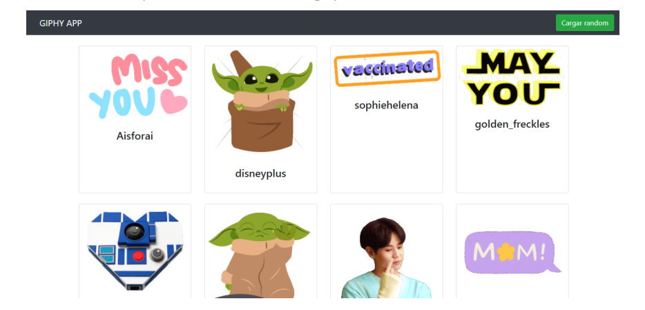

# Creando una aplicación con create-react-app

## Objetivos
- Vamos a crear una aplicación con create-react-app. Luego vamos a identificar
componentes, agregarles estilos y hacer consultas a una API externa.
- Al finalizar la aplicación, tendremos un panorama bastante completo de React.

Requisitos

Tener instalado npm: para correr el comando npx, que es una extensión de npm. Este nos
va a permitir usar el comando create-react-app.
Tener una cuenta en Giphy: esta es la API que vamos a consumir desde nuestra app. Te
dejamos el link acá: https://developers.giphy.com.
Recomendamos bajar los siguientes archivos para que el estilo del sitio sea más amigable:
link.

## M9 C45

## Ubicación -> Programación/TRABAJOS PRACTICOS/Creando una aplicación con create-react-app
